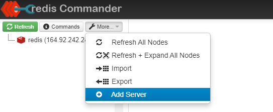
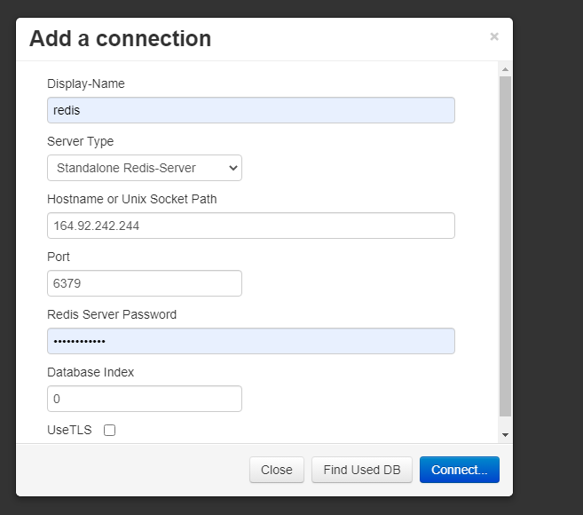

Os acessos para os serviços do projeto são os seguintes:

IP (igual para todos): IP

Mysql Database:
Porta: 3306
Password: jJq!p9vt6Oh9

Redis:
Porta: 6379
Password: 4jy8MSV<3!40

Redis interface
Porta: 8081
Passos para adicionar o servidor redis (necessário):

1. Aceder ao serviço por http://ip:8081
2. Selecionar estás opção:

3. Colocar a seguinte configuração e dar connect:
