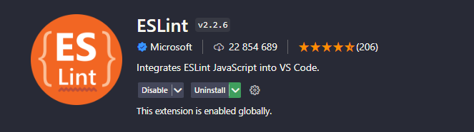

No backend iremos usar uma arquitetura SOLID, que separa cada rota por um caso de uso. É também, separado tudo o que é externo da API e é alterável, para assim so ser necessário modificar em um lugar e ja ficar na API toda.

Para geração de id iremos usar o UUID v4, pois dessa forma conseguimos ver se o id que o utilizador está a passar no request é um id valido.

Para todos estarmos a usar o mesmo padrão de código devemos instalar as seguintes extensões no vscode:


Tipos de requests a ser usados:
GET -> Obter dados
POST -> Criar Dados
PUT -> Alterar Dados
DELETE -> Apagar Dados

Vamos tentar seguir os padrões de status code dos [requests https](https://developer.mozilla.org/en-US/docs/Web/HTTP/Status)

Rota base da api Em produção: https://portugaljobs.diogomarques.dev/api

Todas as rotas do backend vão se encontrar neste [link](https://app.getpostman.com/join-team?invite_code=df534ef693e164f4fd8b9941f14664be&target_code=7f56282bda0dab2b780abc6bea726240)
PS: quando tiverem a testar a api usem `localhost:3333/api`

A api tem um sistema de rate limit, que permite fazer 60 request por minuto, essa limitação por enquanto é feita por ip, porem mais para a frente iremos limitar por token e ip, para permitir que quando varias pessoas estejam a utilizar a app na mesma rede não sejam limitadas.

Dados da API:
```
JWT_SECRET=""
MAIL_HOST=""
MAIL_PORT=
MAIL_USER=""
MAIL_PASS=""
MAIL_NOREPLY=""
```