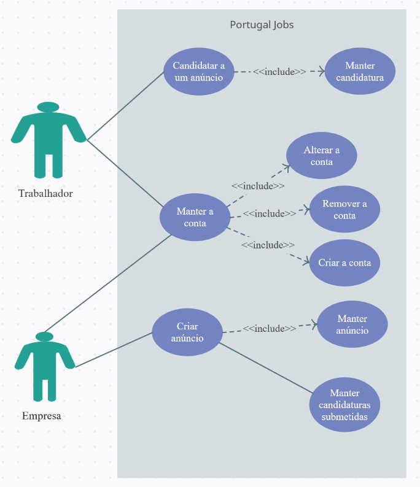

Overview: O produto é descrito por uma aplicação mobile que tem a finalidade de hospedar anúncios de emprego. As empresas publicam os anúncios, e os trabalhadores realizam a sua candidatura, através de apenas um clique, já que para a mesma é utilizado o currículo associado ao perfil.

A criação de contas, deverá ser através de um formulário em que vai ter de passar o seu primeiro e último nome, email, password ( 2x ) e telefone. 

A empresa a publicar o anúncio deve ter parâmetros obrigatórios como o título, descrição, localização, nome da empresa, cargo do trabalho ,tipo de contrato e o tipo de trabalho( remoto, presencial ou híbrido ). Em parâmetros opcionais vai ter a possibilidade de adicionar um salário fixo/negociável, e os requisitos para a vaga. 

O trabalhador poderá filtrar os anúncios por localização, cargo do trabalho, tipo de trabalho. Caso se decida candidatar a um dos anúncios é so clicar em "Candidatar", e depois a empresa poderá atualizar o estado da candidatura para aceite, recusado ou em análise. 

