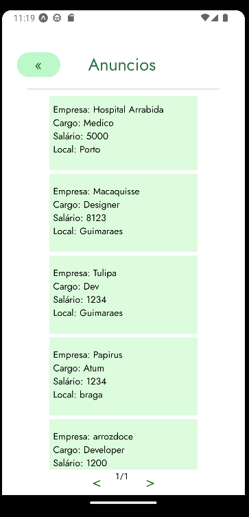
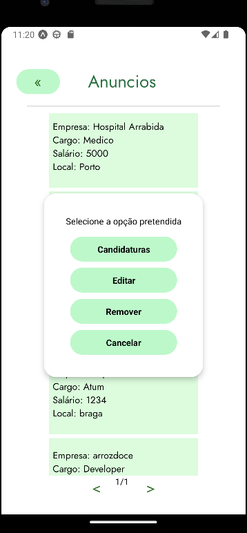
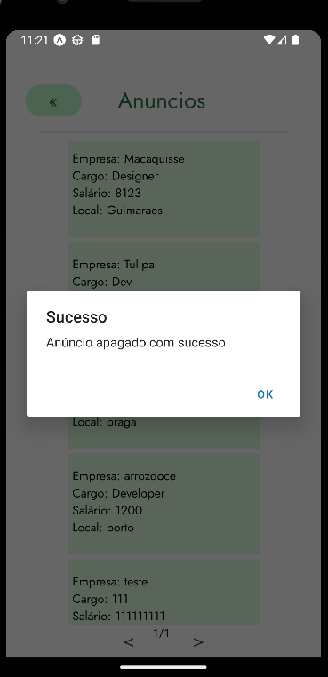

**Botão de Apagar anúncios:**

Após clicar num dos anúncios criados pelo o utilizador irá abrir um popup com várias opções, se o mesmo escolher a opção de "Remover" o mesmo apaga o anúncio que escolheu e também apaga as candidaturas que foram feitas para o mesmo.

O design UI/UX foi feito no Figma

Após clicar num dos anúncios que pretendo aparece um popup com as seguintes opções:

 

Após escolher a opção de "Remover":

