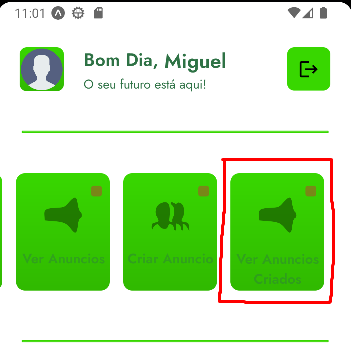
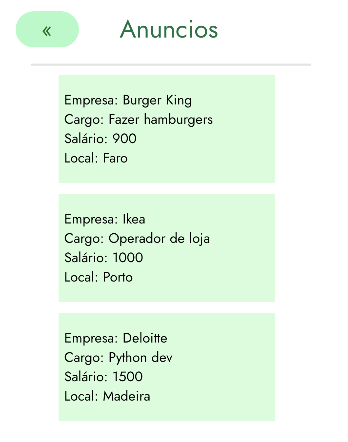
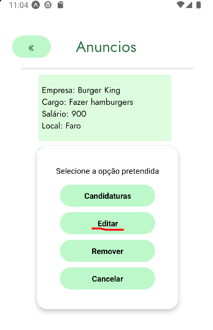
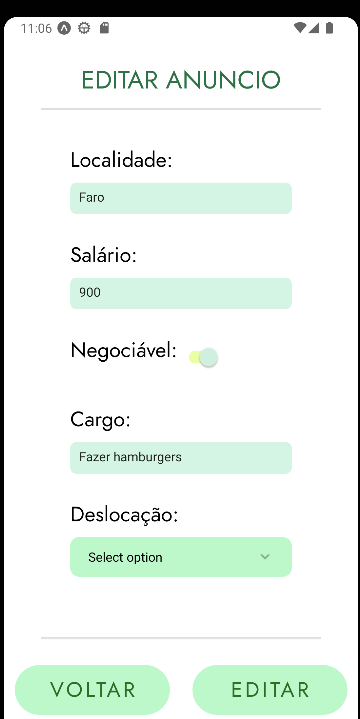

Na tela de "Editar Anuncio" o utilizador terá de preencher os campos dos quais pretende editar e após preencher os mesmos basta clicar no botão de `EDITAR` para editar o anuncio em questão. Caso o utilizador escolha em clicar no botão de `VOLTAR` o utilizador volta para a tela dos anúncios criados pelo mesmo.

Para editar um anúncio terá que entras na aba de `Ver Anúncios Criados` 

Posteriormente é apresentada a tela dos anúncios criado pelo mesmo, ou seja eu para editar um anúncio tenho de clicar naquele que quero mudar algumas informações e posteriormente clicar em `Editar`

Posteriormente é apresentado o anúncio com as informações que já estavam no anúncio, facilitando a visualização do que já está e o que pretende preencher.

Poderá editar os seguintes campos:

"Localidade"
"Salrio"
"Negociável"
"Cargo"
"Deslocação"
"Descrição"
"Requerimentos"
"Tipo de contrato"

Para visualizar os campos todos terá que fazer scroll down.
Tanto o campo de deslocação como o de Tipo de contrato estão com um bug, e não apresentam a informação do que já estava antes, porém se optar por clicar em editar o anúncio irá com o que já estava no anúncio como por exemplo "presencial" e "efetivo". Ou seja se quiser mudar pode mudar e será a ótica normal, mas no caso de não mudar nada fica o que já estava em back aquando a criação do anúncio/última edição.

O design UI/UX foi feito no Figma