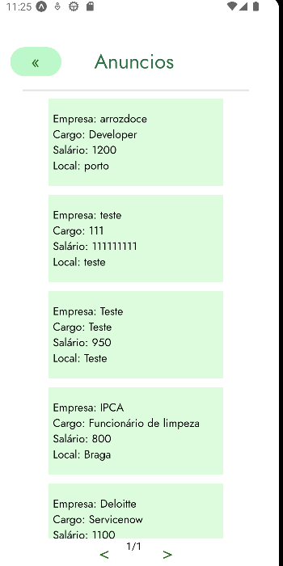
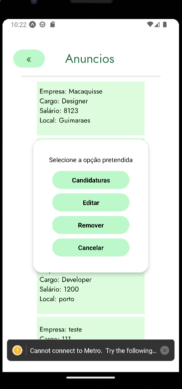

Na tela de "Vêr Anuncios Criados" o utilizador poderá analisar todos os seus anúncios e também ao clicar num do seu interesse irá aparecer um popup com várias opções:

- "Candidaturas" o mesmo poderá analisar todas as candidaturas que foram feitas para o seu anuncio;
- "Editar" o mesmo poderá editar algumas informações do seu anuncio;
- "Remover" o mesmo poderá remover o seu próprio anuncio;
- "Cancelar" o mesmo fecha o popup sem efetuar nenhuma alteração.

Caso o utilizador tenha criado mais de 10 anúncios irá ser adicionado mais 1 página. 

O design UI/UX foi feito no Figma

tela de Anuncios:

