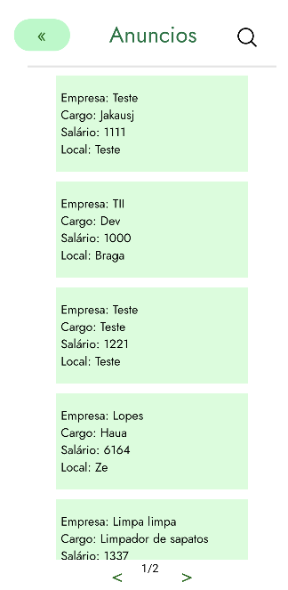
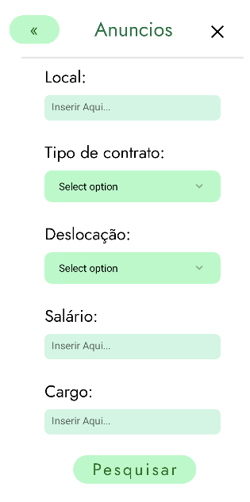
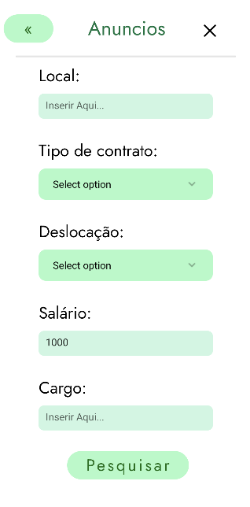
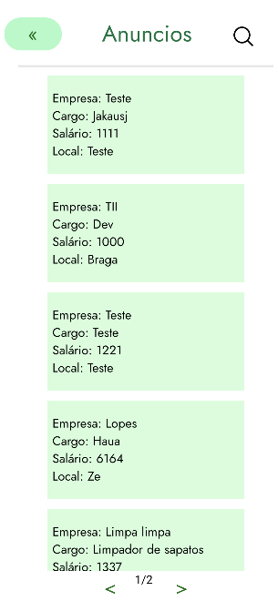

Na tela de "Vêr Anúncios" o utilizador pode pesquisar com filtros por algum anuncio específico ou visualizar todos os anúncios existentes.  

- Após clicar num dos anúncios o utilizador irá para uma tela chamada "Vêr um anúncio especifico" onde o mesmo poderá analisar mais informações sobre o anuncio e também poderá se candidatar.
- Caso o utilizador tenha criado mais de 10 anúncios irá ser adicionado mais 1 página.

O design UI/UX foi feito no Figma

Segue os testes realizados e a app:

Tela de Filtros:

Tela de Filtros com o Salário preenchido:

Tela após carregar no botão de _Pesquisar_ :

