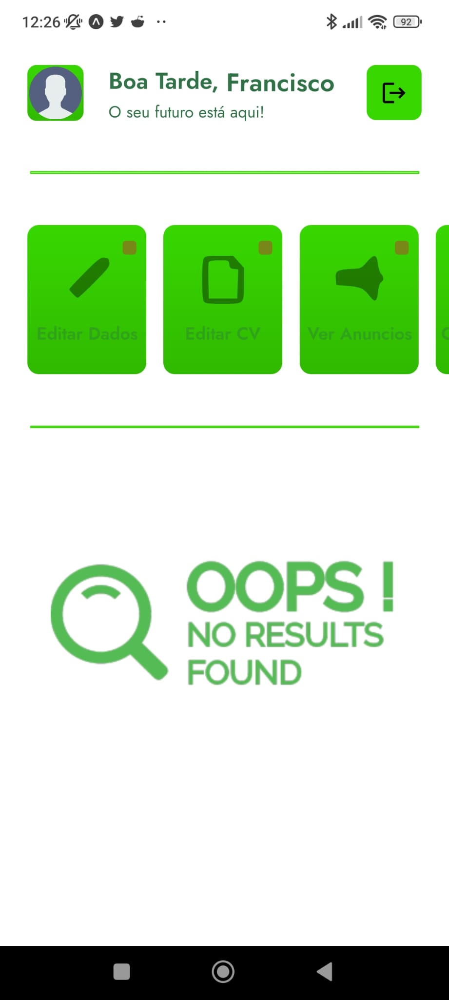
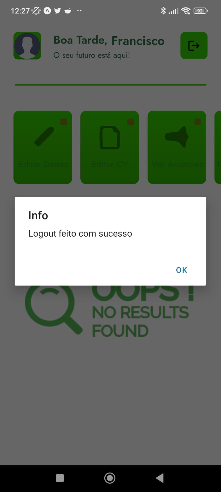
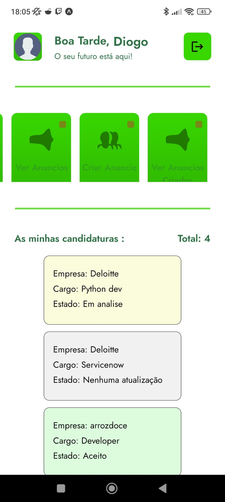
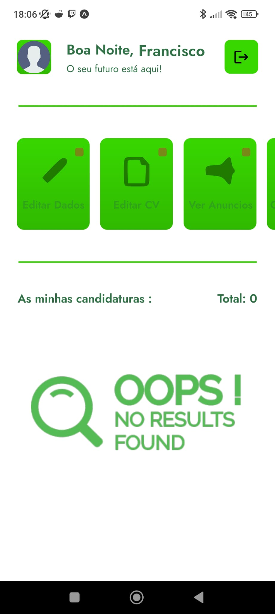

Para a Home Page o utilizador será cumprimentado dependendo da hora do dia

 - O Botão no canto superior direito dá logout da conta
 - Em baixo do header o utilizador tem 5 botões:

   - Editar dados, que faz a paginação para a tela de editar dados
   - Editar CV, que faz a paginação para a tela de editar CV
   - Ver anuncios, que faz a paginação para a tela para ver anuncios
   - Criar anuncios, que faz a paginação para a tela para criar anuncios
   - Ver anuncios, que faz a paginação para a tela para ver anuncios que o utilizador criou

 - Além Disso em baixo dos botões o utilizador tem a lista de todas as suas candidaturas que tem uma cor diferente dependendo do estado:

   - "Nenhuma atualização" = cinzento 
   - "Aceite" = verde
   - "Recusado" = vermelho
   - "Em analise" = amarelo

- HomePage:

- Após clicar no botão de logout:

e será retornado para a pagina de login/register

- Tela com um user com candidaturas:

- Tela com um user sem candidaturas:

