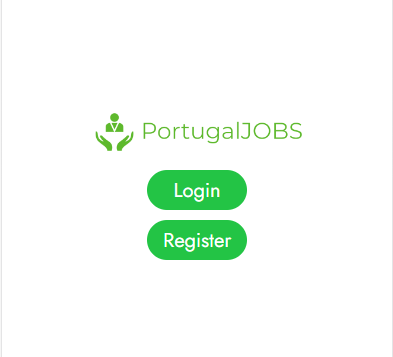

Na tela inicial podemos encontrar um logótipo e dois botões, um dos botões é do "Login" onde ao clicar nele vai diretamente para a tela do Login e o outro botão é o de "Register" onde ao clicar no mesmo vai diretamente para a tela do registo.

O design UI/UX foi feito no FIGMA

