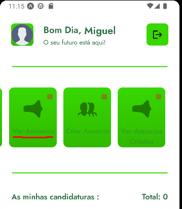
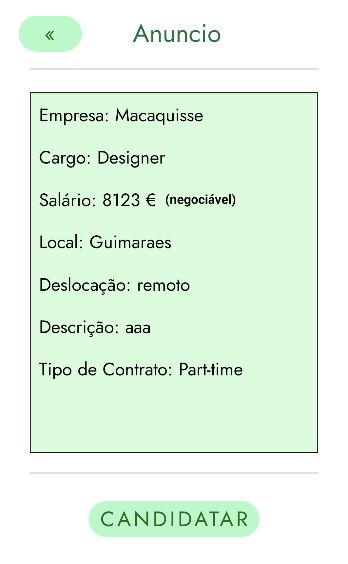
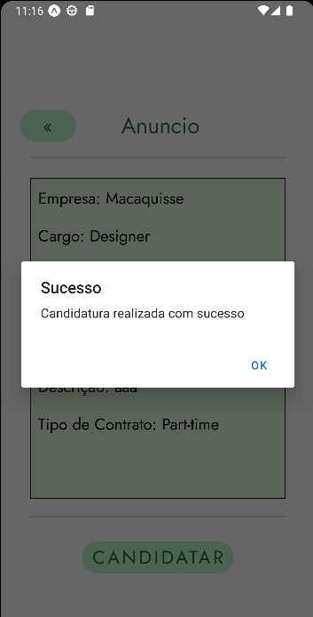
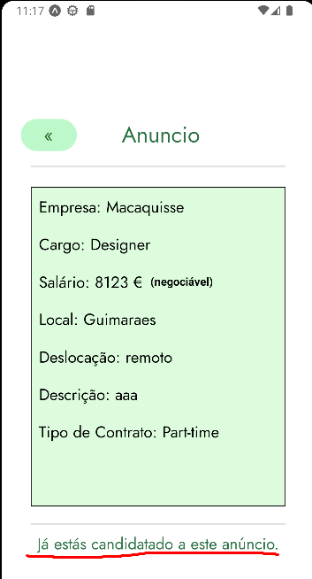

Para efetuar a candidatura a um anúncio primeiro deverá clicar no retângulo de `Ver anúncios` e depois escolher qual o que deseja se candidatar, clicando/pressionando o anúncio respetivo e depois dentro do anúncio especifico clicar em candidatar.

Caso a candidatura seja realizada com sucesso o utilizador recebe um popup com a confirmação.

Outros aspetos:
- Caso ao clicar no anúncio e já esteja candidatado será apresentado a mensagem respetiva, avisando o utilizador e não dando a opção pelo menos pelo frontend de se candidatar.

