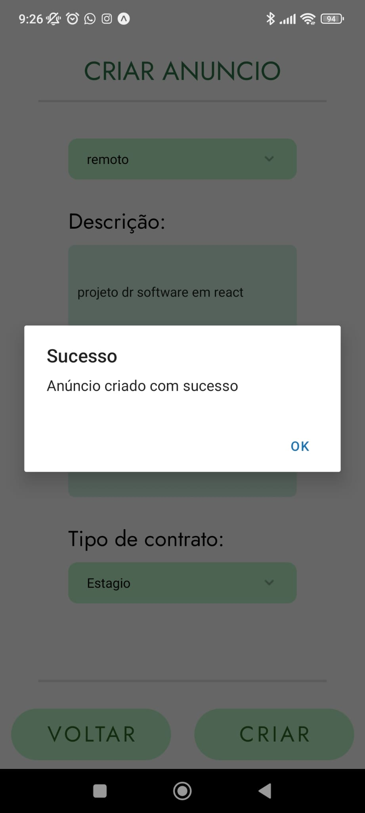

Na tela de "Criar Anuncio" o utilizador terá de preencher os seguintes campos corretamente e após preencher os mesmos basta clicar no botão de "Criar" para criar o anuncio, caso o utilizador escolha em clicar no botão de "voltar" o utilizador volta para a "HomePage".

Campos a serem preenchidos para criar um anuncio:

- "Nome da Empresa"
- "Localidade"
- "Salario"
- "Negociavel"
- "Cargo"
- "Deslocação"
- "Descrição"
- "Requerimento"
- "Tipo de contrato"

O design UI/UX foi feito no Figma

Preenchimento de dados na app:

Cria o Anuncio na base de dados

Caso não preencha algum campo aparece o seguinte alerta (nota: o campo Requirimento não é obrigatório):

Caso preencha mal as SelectLists (Deslocação, Tipo de contrato)

[preenchermalselectlist1.jpg](../../../.attachments/preenchermalselectlist1-05fbab32-94bd-4d25-812f-7d3fc628e53a.jpg)
!