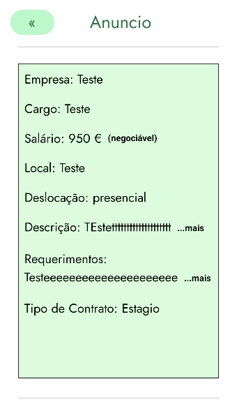
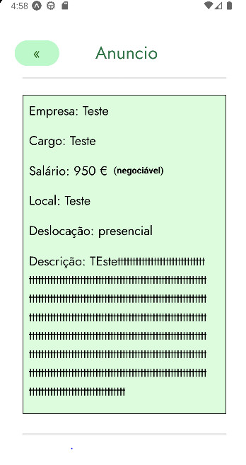
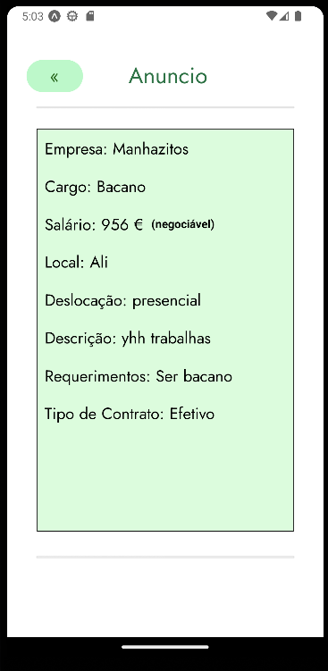
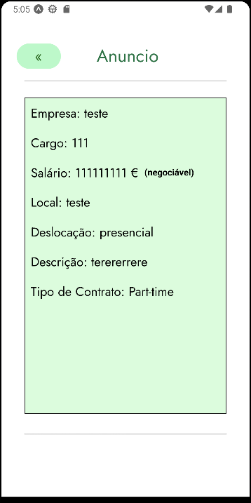

Na tela de "Vêr um anúncio especifico" o utilizador após selecionar um anuncio na tela de "Vêr Anúncios" o mesmo irá para outra tela para poder analisar outras informações sobre o mesmo que selecionou.

Nesta tela também contém o botão de "candidatar" onde o utilizador poderá se candidatar para o mesmo.

Foi adicionado também uma função para definir a quantidade de caracteres que vão aparecer e de um botão com o nome de "...mais" que ao clicar irá exibir o resto da mensagem.

 O design UI/UX foi feito no Figma

Após clicar um anúncio à sua escolha na tela de ver anúncios irá para outra tela onde irá mostrar mais dados sobre o mesmo:

Quando na descrição ou nos Requerimentos do texto tiver mais de 25 caracteres, tudo o que estiver após desses 25 irá ser "cortado" e exibido um botão "...mais" que ao clicar no mesmo irá expandir o resto da mensagem. Exemplo da mesma imagem de cima mas com o botão do "...mais" pressionado:

Exemplo de um Anúncio sem os 25 caracteres na descrição: 

Como o Requerimento é opcional caso alguém crie um Anúncio e não tenha escrito nada nessa opção o mesmo não irá aparecer na tela da especificação do mesmo anuncio:

 

