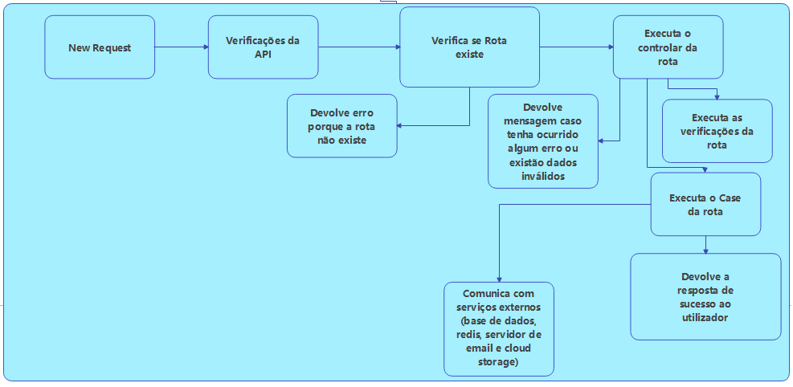

O nosso backend foi feito usando a linguagem de programação typescript, para base de dados usamos o mysql e ainda usamos o redis para fazer cache de algumas informações, como os tokens de utilizadores, o rate limit que é feito por ip, e o código de verificação de conta.
A estrutura do Backend vai ser monolitico, e vai usar a arquitetura SOLID.

Estrutura de funcionamento do backend:

A baixo explico as dependências que usamos e o porque de usar as mesmas:
- **babel:** Usado para compilar o typescript para javascript e depois o executar em ambiente de produção;
- **eslint:** Usado para todos os desenvolvedores seguirem o mesmo padrão de código;
- **ts-node e ts-node-dev:** Usado para executar o typescript em ambiente de desenvolvimento e testes,
- **@types/*:** Dependências usadas para conseguirmos ter a tipagem de dependências que não a trazem nativamente;
- **prisma:** Dependência do ORM que utilizamos para gerar a base de dados com base no schema que definimos em `prisma\schema.prisma`;
- **@prisma/cliente:** Usado para `selects/inserts/updates/deletes` a base dedados;
- **fastify:** Usado para criação da base da nossa api;
- **pino-pretty:** Usado para conseguirmos deixar as logs da api de uma forma mais legível e bonita/agradável;
- **@fastify/env:** Usado para carregar as variáveis de ambiente;
- **@fastify/refis:** Usado para fazer a conexão ao redis e manipulação dos dados do mesmo;
- **@fastify/rate-limit:** Usado para fazer o controle de requests a nossa api, sendo que o limit é 60 por minuto, caso o utilizador faça mais 10 requests que esses ele ira ser banido da mesma;
- **fastify-plugin:** Usado para criação dos nossos proprios `Plugins` para o fastify, como por exemplo o `src\customPlugins\googleCloudStorage.ts` (usado para adicionar a conexão do google cloud storage ao fastify) e o `src\customPlugins\prismaPlugin.ts` (usado para adicionar a conexão do prisma ao fastify);
- **@fastify/multipart:** Usado para conseguirmos receber arquivos nos requests POST e PUT;
- **fastify-bcrypt:** Usado para fazer encriptação da password antes de salvar a mesma na base de dados;
- **@fasitfy/jwt:** Usado para gerar os tokens de autenticação usando o padrão `BEARER`, e para também fazer a decodificação do mesmo;
- **@fastify/cors:** Usado para limitar os acessos e métodos que podem ser feitos a api;
- **@fastify/swagger:** Usado para gerar o "esquema" para o fastify;
- **@fastify/swagger-ui:** Usado para gerar o website da documentação usando o esquema gerado pelo swagger
- **@google-cloud/storage:** Usado para efetuar a conexão ao google cloud storage e manipulação dos arquivos salvos no mesmo;
- **nodemailer:** Usado para fazer conexão com o servidor de emails e conseguir enviar os mesmos;
- **handlebars:** Usado para manipulação dos arquivos de templates de email localizados em `src\views\emails`, podendo assim "adicionar" variáveis no template e depois fazer troca pelos valores que desejamos, para isso ser possível é so declarar a variável no template usando o seguinte padrão `{{var1}}`;
- **uuid:** Usado para geração dos ids usados na base de dados, evitando ficar dependentes do sistema de auto incremente da base de dados, e nos facilitando uma futura migração da mesma.

No core da api também existe dois "handlers", que irei explicar abaixo:
- **src\handlers\errorHandler.ts:** handler responsável por gerir os erros da api, sendo que existem erros criados por nós, como por exemplo o `src\errors\AppError.ts`, e também existem os erros criados por falhas no código ou serviços externos que utilizamos, sendo que quando algum erro chega ao request o mesmo deve formular uma resposta para responder ao request dependendo do erro que deu;
- **src\handlers\notFoundHandler.ts:** handler responsável por controlar a resposta quando o utilizador tenta aceder a uma rota que não existe, e também adicionar o request no rate limit do utilizador;
