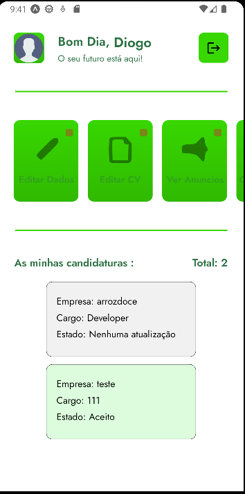
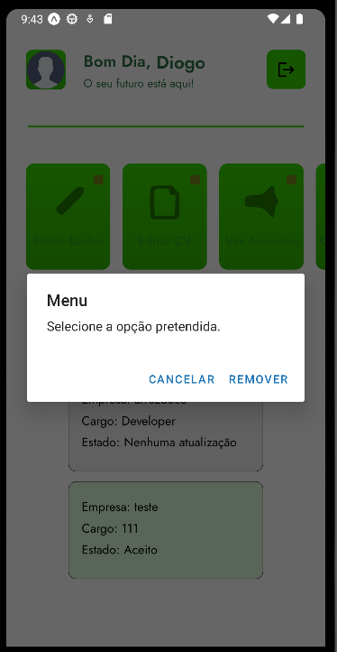
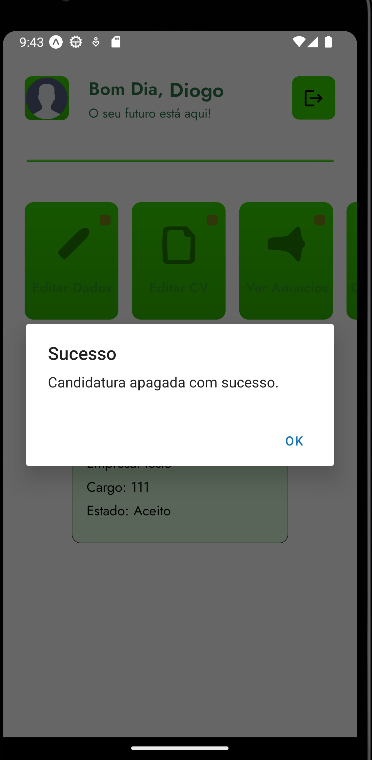

**Botão de apagar as candidaturas**:

Ao clicar numa das candidaturas que têm o estado de "Nenhuma atualização" irá aparecer um popup com algumas opções, caso o utilizador escolha a opção de "Remover" o mesmo apaga a sua candidatura e a empresa para qual o utilizador se candidatou já não irá conseguir analisar a candidatura do mesmo.

O design UI/UX foi feito no Figma

Exemplo de ao clicar na candidatura com o estado de "Nenhuma atualização":

Após de clicar em Remover:

