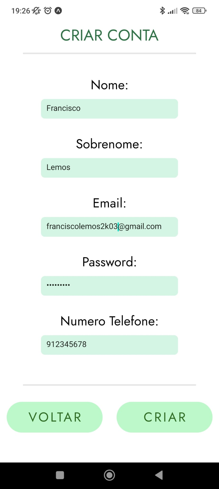
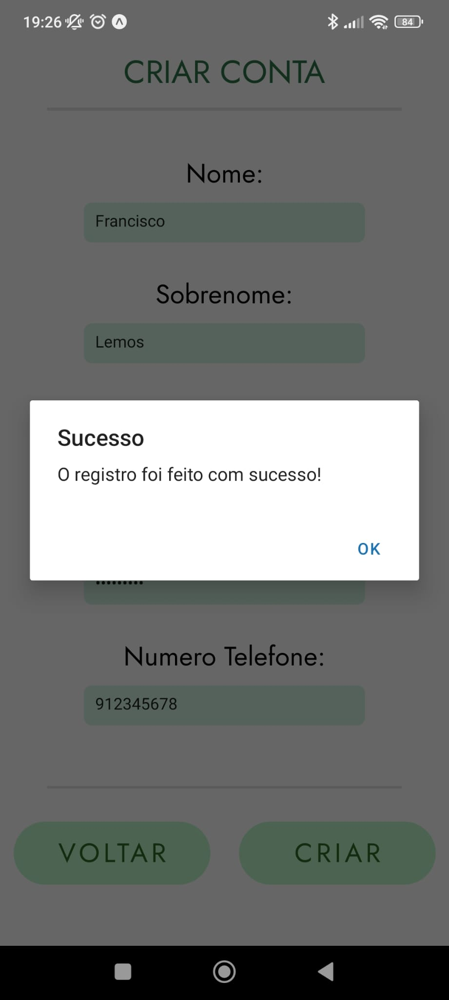
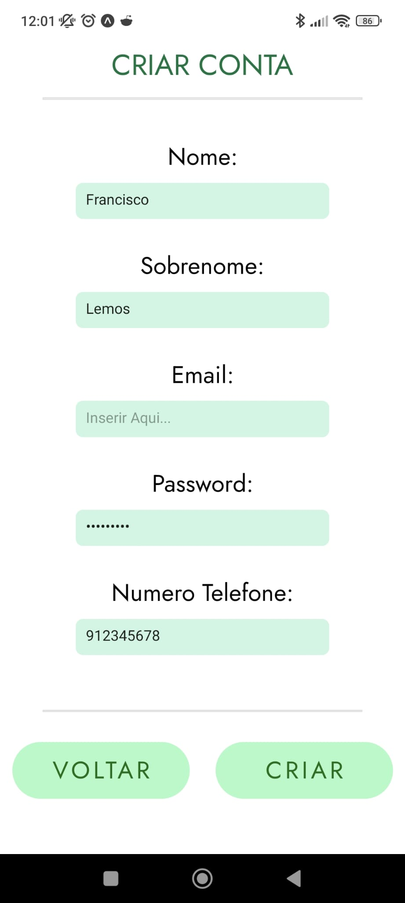
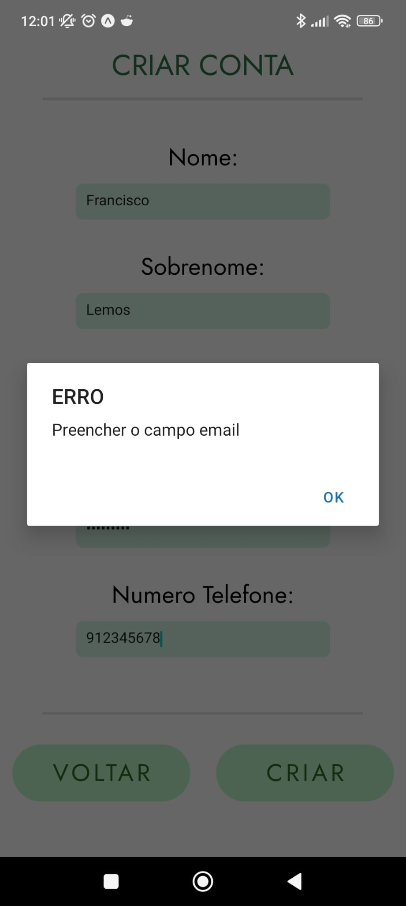

Na tela de "Criar Conta" o utilizador terá de preencher corretamente todos os campos e no final para confirmar os dados basta clicar no botão de "Criar".

O utilizador tem que inserir: 

- Nome
- Sobrenome
- Email
- Password
- Numero de telemovel

Segue os testes realizados e a app:

Preenchimento de dados na app:

Depois de clicar em criação de conta aparece um Alert a dizer que foi criado com sucesso e cria conta na base de dados

caso não preencha algum campo aparece o seguinte alerta:

nota: O campo Password tem asteriscos a tapar para segurança de dados