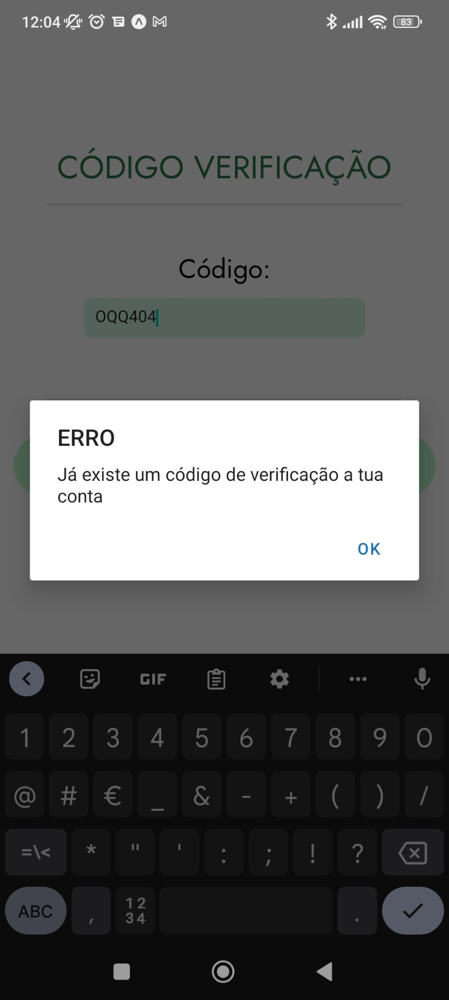

Na tela de "Código Verificação", o utilizador após criar a conta recebe no email um código para depois inserir o mesmo para evitar spam de criação de contas e inserção de emails veridicos.

- O botão Reenviar reenvia um código de verificação diferente (só é possivel enviar um código novo de 30 em 30 minutos).
- o botão Validar valida se o código inserido está correto ou não.

Segue os testes realizados e a app:

- ***Preenchimento do codigo na app com o código errado:***

- ***Preenchimento do codigo na app com o código certo:***

- Só é possivel reenviar código após 30min:

